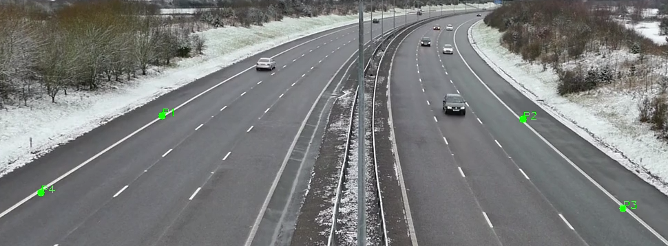
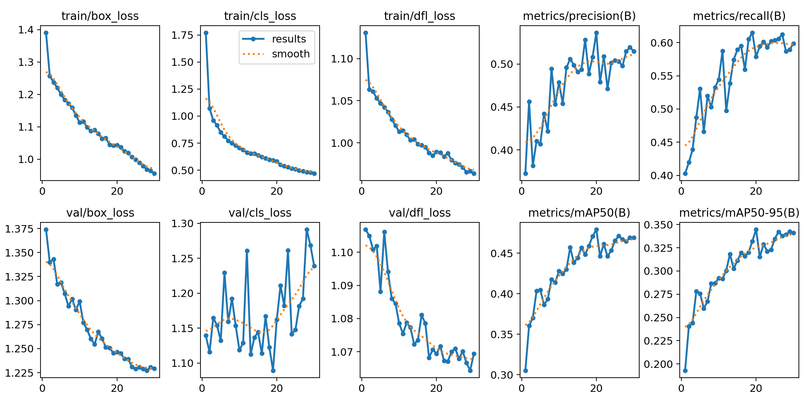

# Vehicle Tracking and Behavior Analysis System

## Project Overview

The primary goal of this project is to track and analyze vehicles in high-speed highway videos to identify erratic behavior before it escalates. By leveraging the YOLOv8 model for vehicle detection and a Kalman filter for vehicle tracking, the system aims to assign unique IDs to vehicles, predict their future positions, and analyze their behavior based on their path, speed, and erratic movements. This has the potential to improve traffic safety by detecting dangerous driving patterns early, ultimately preventing accidents and helping to improve highway traffic management.

In this project, we assume that the vehicles are moving on a high-speed highway, and the camera is set up in such a way that it captures a slight aerial view of the road. Based on these assumptions, we have worked on real-world parameters to track vehicle movement and predict their behavior. However, since we are not fully certain of the exact vehicle speeds, we are not considering speed as a direct factor in detecting erratic driving at this stage. The analysis currently focuses on vehicle path and behavior, under the assumption that the vehicles are already traveling at high speeds on the highway.


### Key Features:

- **Vehicle Tracking with Kalman Filter**:  
  The system tracks vehicles across video frames, utilizing a Kalman filter to predict the future location of each vehicle based on its previous state (position and velocity).  
  **ID Assignment**: By comparing the predicted and actual positions, the system assigns accurate IDs to vehicles, even when there is temporary occlusion or loss of tracking.

- **Frame Skipping for Robust Tracking**:  
  To enhance the robustness of tracking, we incorporated frame skipping. This means that even if a vehicle is temporarily lost in some frames, the Kalman filter's prediction helps re-associate the vehicle's ID with its correct trajectory in the next frames.

- **Speed and Behavior Analysis**:  
  Vehicles traveling at high speeds (greater than 80 km/h) are tracked and analyzed for their behavior. This system calculates the speed of vehicles based on their real-world coordinates (using a homography matrix) and stores the path data for further analysis.

- **Erratic Behavior Detection**:  
  The system can detect erratic behavior based on the vehicle's movement path. If the vehicle takes sharp turns or deviates from a typical path (calculated by the angle between consecutive points), it flags the vehicle for erratic driving.

---

## How Kalman Filter is Used for Vehicle Tracking

In this system, the **Kalman filter** is employed for robust vehicle tracking. The filter helps predict the future position of a vehicle based on its previous position and velocity, ensuring that the ID of the vehicle remains consistent even when the vehicle is temporarily out of the camera's view or occluded by other vehicles.

### Kalman Filter Steps:

1. **Prediction Step**:  
   The Kalman filter uses the previous state of the vehicle (position and velocity) to predict its future state (next position).  
   The state vector `[x, y, dx, dy]` is used, where:  
   - `(x, y)` is the position of the vehicle,  
   - `(dx, dy)` is the velocity.

2. **Update Step**:  
   When the vehicle reappears in the frame, its actual position is measured, and the Kalman filter updates its prediction.  
   The predicted position and the measured position are fused to give a more accurate estimate of the vehicle's location.

3. **Frame Skipping**:  
   In some cases, vehicles may be temporarily lost. Frame skipping allows us to predict the vehicle's location even if we miss a few frames, making the ID assignment more robust.

### ID Assignment and Tracking:
- The predicted position is compared to the detected vehicle’s position in the current frame. If the predicted and detected positions match closely, the same ID is assigned to the vehicle.  
  This helps in continuously tracking each vehicle, even if there is some temporary loss of detection.

---

## Path Analysis and Speed Calculation

This project assumes that the vehicles are traveling at high speeds (greater than 80 km/h), which is typical for highways. The **path analysis** module helps track the trajectory of each vehicle and analyze its speed and behavior.

### Key Steps:
1. **Real-World Speed Calculation**:  
   The speed of a vehicle is calculated when it moves from one point to another in real-world coordinates (derived from the homography matrix). The calculation is based on the Euclidean distance between two consecutive points in real-world coordinates and the time taken to traverse that distance.

2. **Homography Matrix**:  
   The system uses a **homography matrix** to transform coordinates from the image frame to real-world coordinates. This transformation is essential for accurately estimating speed and detecting erratic behavior.  
   

   The homography matrix is calculated using real-world coordinates and corresponding points in the image frame.

---

## Setting Up the Real-World Coordinate System

To calibrate the system, you need to define a real-world region (such as a 10x7 meter square) and map it to the image coordinates. This is the first step after setting up the environment.

### Steps for Calibration:

1. **Define the Real-World Coordinates**:  
   Specify the dimensions of the real-world area you want to map (e.g., 10x7 meters).  
   Identify the corresponding points in the image that represent these real-world coordinates.

2. **Run the Calibration Script**:  
   The `compute_homography` function calculates the homography matrix based on the real-world and image points.  
   The transformation is used to map the vehicle's detected coordinates to the real-world coordinates.

3. **Example**:  
   Suppose the real-world area is a 10x7 meter square. You will select the four corners of this square in the video frame and input these points into the calibration script.  
   The system will then compute the homography matrix that transforms these image points to real-world coordinates.

---

## Visualization and Tracking Flow

The vehicle tracking and behavior analysis are visualized in the following steps:

1. **Detection**:  
   YOLOv8 is used to detect vehicles in each frame. These detections are processed to extract vehicle positions and bounding boxes.  
  

2. **Tracking**:  
   The Kalman filter is used to track the vehicles and predict their future positions.  
   IDs are assigned to vehicles, ensuring they remain consistent across frames.

3. **Speed and Path**:  
   The speed and path of each vehicle are calculated and displayed on the frame.  
   The path is drawn by connecting the positions of the vehicle in previous frames.  
  

4. **Erratic Behavior**:  
   The system analyzes the path of each vehicle. If erratic behavior (sharp turns or abrupt movements) is detected, the vehicle is flagged.  
   The behavior is visualized by drawing the bounding box in a different color and saving the frame if necessary.  
   

5. **Final Visualization**:  
   The final frame is displayed with annotations such as vehicle ID, speed, class (car, truck, etc.), and confidence score.  
   The vehicle’s path is also drawn, and erratic behavior is flagged visually.

---

## Fine-Tuning the YOLOv8 Model

The system utilizes a fine-tuned YOLOv8 model, trained on a custom dataset from Roboflow. The model has been fine-tuned to enhance its vehicle detection and localization capabilities, particularly in high-speed highway scenarios.

### Training Process:

1. **Dataset:** The Vehicles dataset from Roboflow (link: [Vehicles dataset](https://universe.roboflow.com/roboflow-100/vehicles-q0x2v)) contains:
   - 2634 training images
   - 966 validation images
   - 458 test images
     This dataset is labeled for vehicle detection, allowing the model to recognize various vehicle types under different conditions.

2. **Fine-Tuning:** The YOLOv8 model has been fine-tuned on this dataset to improve its ability to localize vehicles. Fine-tuning adjusted the model’s weights, allowing it to accurately identify and draw bounding boxes around vehicles in dynamic, high-speed highway scenarios. This process ensures improved performance and efficiency in detecting vehicles in real-time applications.

### Model Evaluation

**Metrics**




---

## Script Workflow

The overall flow of the scripts is as follows:

1. **Setup**:  
   Install dependencies using the `setup.sh` script or manually.  
   Calibrate the real-world coordinates by selecting points in the video frame.

2. **Inference**:  
   The `inference.py` script processes the video, detecting and tracking vehicles.  
   It uses YOLOv8 for detection, the Kalman filter for tracking, and computes the speed and path for each vehicle.  
   Erratic behavior is detected, and the system flags and saves images of such events.

3. **Path Analysis**:  
   The `path_analysis.py` script detects erratic behavior and saves data about vehicle paths when they cross a defined region.

4. **Vehicle Tracking**:  
   The `tracking.py` script assigns unique IDs to vehicles and tracks their movement using the Kalman filter.

---

## Setup Instructions

### Prerequisites

Make sure you have the following:

- **Python 3.7+** installed.
- **Conda** installed for managing virtual environments.

### Clone the repository

First, clone the repository to your local machine:

```bash
git clone https://your-repository-url.git
cd your-repository-folder
```

The project provides a setup.sh script to set up the Conda environment and install all necessary dependencies. This script will also download the required YOLOv8 model.

Run the following command to start the setup process:

```
.\setup.sh
```

After the setup script completes, activate the Conda environment:

```
conda activate hackathon_env
```

## Configuration

### Input Files
- Video Input: The input video file to be processed. By default, it looks for sprites/v1.mp4.
- Model File: The trained model file in PyTorch format (.pt). Default is models/m1/weights/best.pt.
- Calibration Points: YAML file containing the calibration points used for perspective transformation. Default is data/points/calibration_points.yml.

Make sure you have these files in the correct paths or specify your own.

### Usage
You can run the vehicle tracking with the following command:

```python main.py --video_path path/to/your/input_video.mp4 --output_path path/to/save/output_video.mp4 --device cpu --model_path path/to/your/model.pt --calibration_points path/to/calibration_points.yml```

### Arguments:

- --video_path (str): Path to the input video file. (Default: 'sprites/v1.mp4')
- --output_path (str): Path where the output video will be saved.
- --device (str): The device to run the model on. Options are 'cpu' or 'gpu'. (Default: 'cpu')
- --model_path (str): Path to the trained model file. (Default: 'models/m1/weights/best.pt')
- --calibration_points (str): Path to the YAML file containing calibration points for perspective correction. (Default: 'data/points/calibration_points.yml')
  
### Examples:
```python main.py --video_path sprites/v1.mp4 --output_path output/video_result.mp4 --device cpu --model_path models/m1/weights/best.pt --calibration_points data/points/calibration_points.yml```

This will process the video **v1.mp4** using the model at **best.pt** and save the output to output/video_result.mp4.


## Troubleshooting

- If you're running on a GPU, ensure that the correct version of PyTorch with GPU support is installed.
- If you're using custom paths for the model or calibration points, ensure that the file paths are correct.


## Demo Video

Here is a demo video of the vehicle tracking system in action:

[](https://youtu.be/32nXzBIQE9U)


## Disclaimer

We apologize for the incomplete documentation at the moment. There are many opportunities to improve both our implementation and the documentation, and while we have not yet reached the best possible version, we have made significant progress. Our goal is to refine and complete the project with the highest quality possible.

We have worked hard to implement key features and have touched on important aspects of vehicle tracking, including model inference, calibration, and video processing. While some parts are still in progress, we are actively working to finalize everything with the aim of achieving a fully functional and well-documented solution.

We believe our approach has great potential, and we're committed to completing it. Your feedback and suggestions are greatly appreciated, and we are open to further improvements.

Thank you for your understanding!
